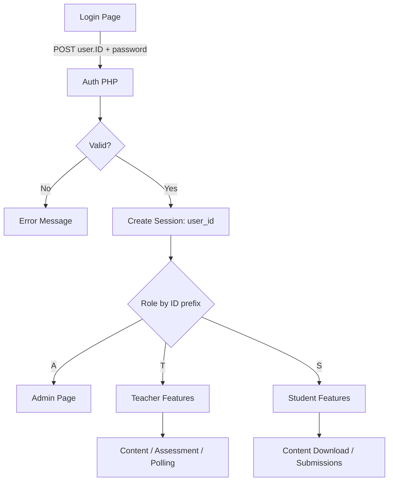

A PHP/MySQL study platform that supports **session-based login**, **student registration**, and role-based features for **Admin / Teacher / Student**.  
Role is determined by the **first character of user ID**:
- `A` = Admin (e.g. A1)
- `T` = Teacher (e.g. T1)
- `S` = Student (e.g. S1)

## Live Demo
- Demo: https://47.129.150.138/whiteboard/login.php

## Tech Stack
- Backend: PHP (POST + Sessions), REST-style endpoints
- Database: MySQL / MariaDB (phpMyAdmin)
- Frontend: HTML, CSS, JavaScript (basic)
- Tools: Git, GitHub

---

## Key Features

### Authentication & Roles
- Login using `user.ID` + password (PHP sessions)
- Student registration
- Role-based access control via ID prefix (A/T/S)

### Admin
- Create teacher accounts
- Create/delete student accounts
- Delete polls

### Teacher
- Upload notes and assignments
- Delete notes/assignments in Content page
- Delete polls

### Student
- Download notes/assignments published by teachers
- Submit assignments (upload submissions)

### Forum / Discuss
- Students post messages with timestamp

### Calendar / Activities
- Show important/upcoming/recent activities with due date

### Pages
Profile, Calendar, Content, Forum, Assessment, About Us, Polling, Main Page, Admin Page

---

## System Design (High-level)

### Login & Authorization Flow
1. User submits login form via **POST** (`user.ID` + password)
2. Server verifies credentials against table `user`
3. On success, server creates a **PHP session** (e.g. `$_SESSION["user_id"]`)
4. Each protected page checks session before access
5. Role is determined by **first character of `$_SESSION["user_id"]`**
   - Admin-only actions/pages are restricted to IDs starting with `A`
   - Teacher actions restricted to IDs starting with `T`
   - Student actions restricted to IDs starting with `S`

### Data Transfer Between Pages
- User actions and forms use **POST**
- User identity / login state is stored in **PHP sessions**



---

## Database Schema
`user`
Stores login identity and profile fields.

- `ID` (PK) — used for login account (e.g. A1/T1/S1)
- `Name`, `Pw` (bcrypt hash), `email`, `Last_login_time`, `saftyquestion`, `Answer`
  
`files`
Stores teacher-uploaded materials (notes/assignments).

- `id` (PK), `filename`, `filepath`, `title`, `file_type`, `deadline`, `created_at`
- `file_type` examples: `notes`, `assessment`

`submissions`
Stores student submissions and marks.

- `id` (PK), `student_id`, `file_name`, `file_path`, `deadline`, `mark`, `submitted_at`, `assessment_id`
- Logical relation: `submissions.assessment_id` -> `files.id` (`where files.file_type = 'assessment'`)

`activities`
Calendar items.

- `id` (PK), `type` (important/upcoming/recent), `title`, `course`, `description`, `due_date`, `created_at`

`discuss`
Forum messages.

- `dis_id` (PK), `com_time`, `studentid`, `msag`
- Logical relation: `discuss.studentid` -> `user.ID`

`polls` / `poll_answers`
Poll and poll answers.

- `polls`: `id` (PK), `title`, `description`
- `poll_answers`: `id` (PK), `poll_id`, `title`, `votes`
- Logical relation: `poll_answers.poll_id` -> `polls.id`

```mermaid
erDiagram
  USER ||--o{ DISCUSS : posts
  POLLS ||--o{ POLL_ANSWERS : has
  FILES ||--o{ SUBMISSIONS : referenced_by

  USER {
    varchar ID PK
    varchar Name
    varchar Pw
    varchar email
    datetime Last_login_time
    int saftyquestion
    varchar Answer
  }

  DISCUSS {
    int dis_id PK
    timestamp com_time
    varchar studentid
    varchar msag
  }

  POLLS {
    int id PK
    text title
    text description
  }

  POLL_ANSWERS {
    int id PK
    int poll_id
    text title
    int votes
  }

  FILES {
    int id PK
    varchar filename
    varchar filepath
    varchar title
    varchar file_type
    datetime deadline
    timestamp created_at
  }

  SUBMISSIONS {
    int id PK
    varchar student_id
    varchar file_name
    varchar file_path
    datetime deadline
    float mark
    datetime submitted_at
    int assessment_id
  }

  ACTIVITIES {
    int id PK
    enum type
    varchar title
    varchar course
    text description
    datetime due_date
    timestamp created_at
  }

Screenshots
Place images under docs/screenshots/ and embed them here.

Example:

docs/screenshots/login.png
docs/screenshots/admin.png
docs/screenshots/content.png
docs/screenshots/assessment.png
